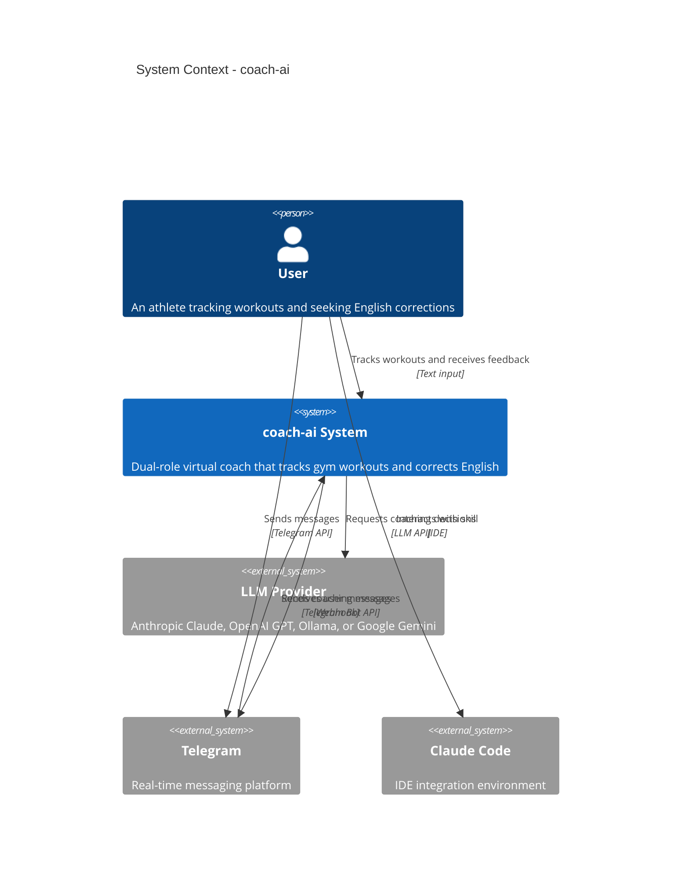
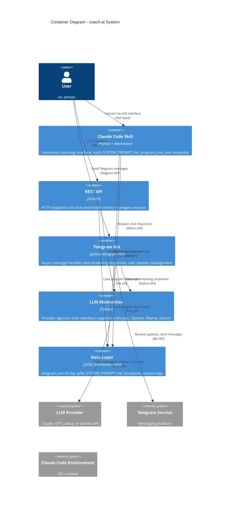
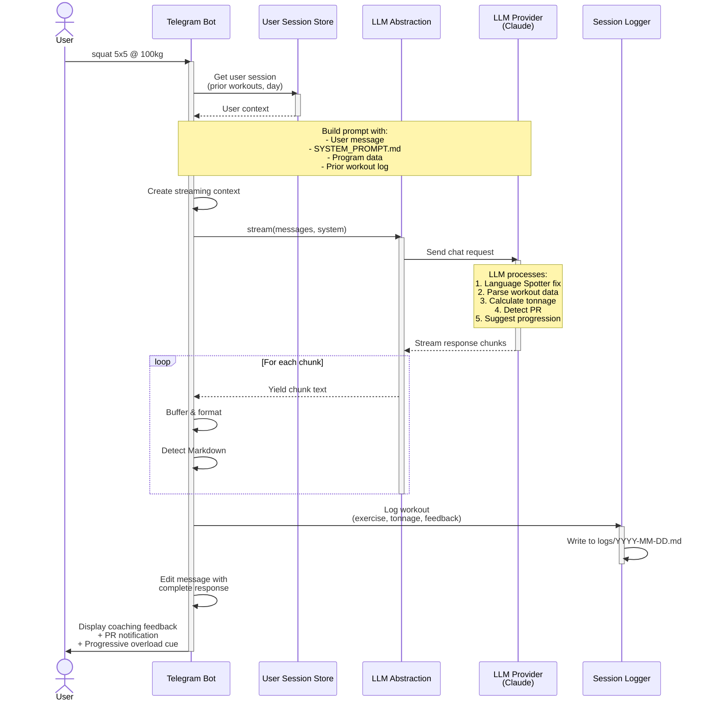
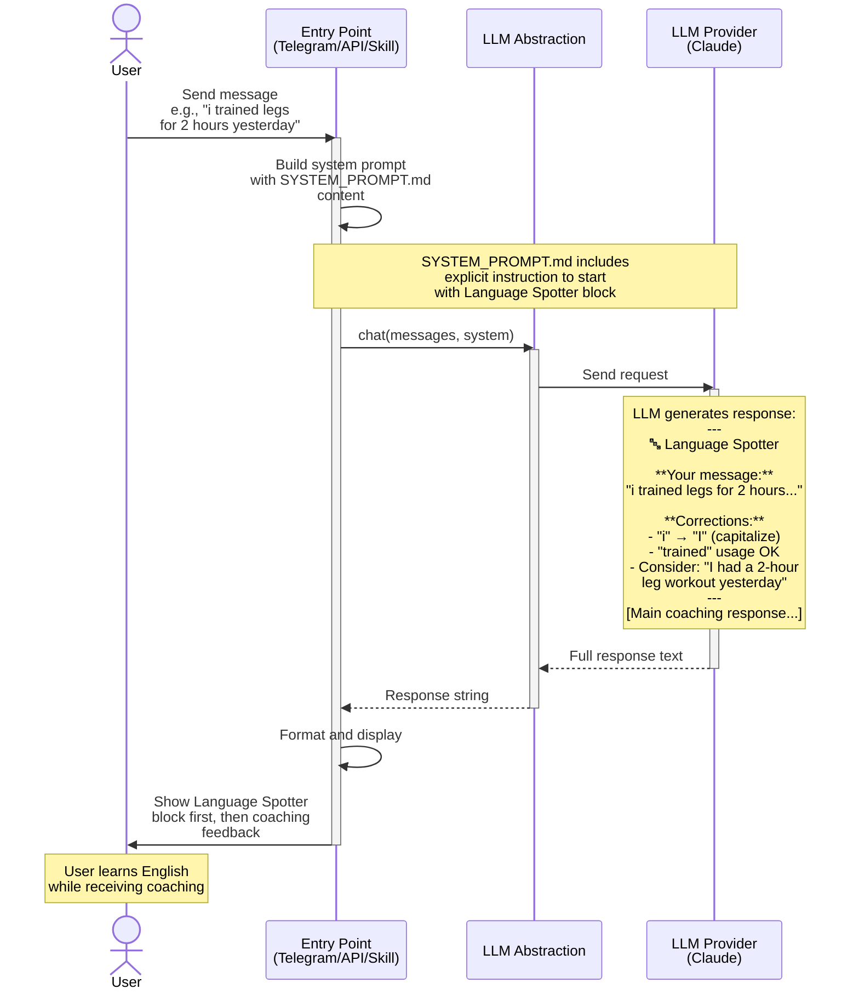
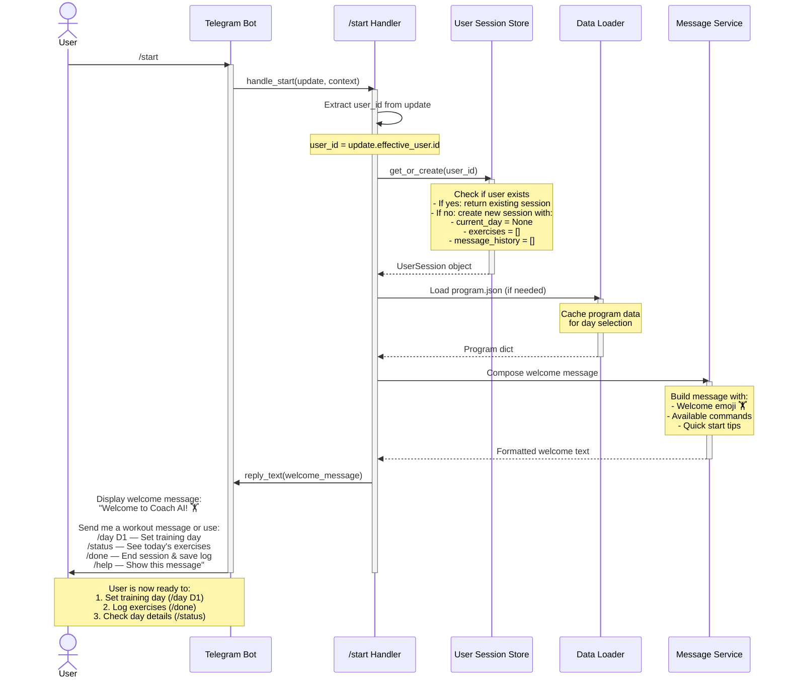
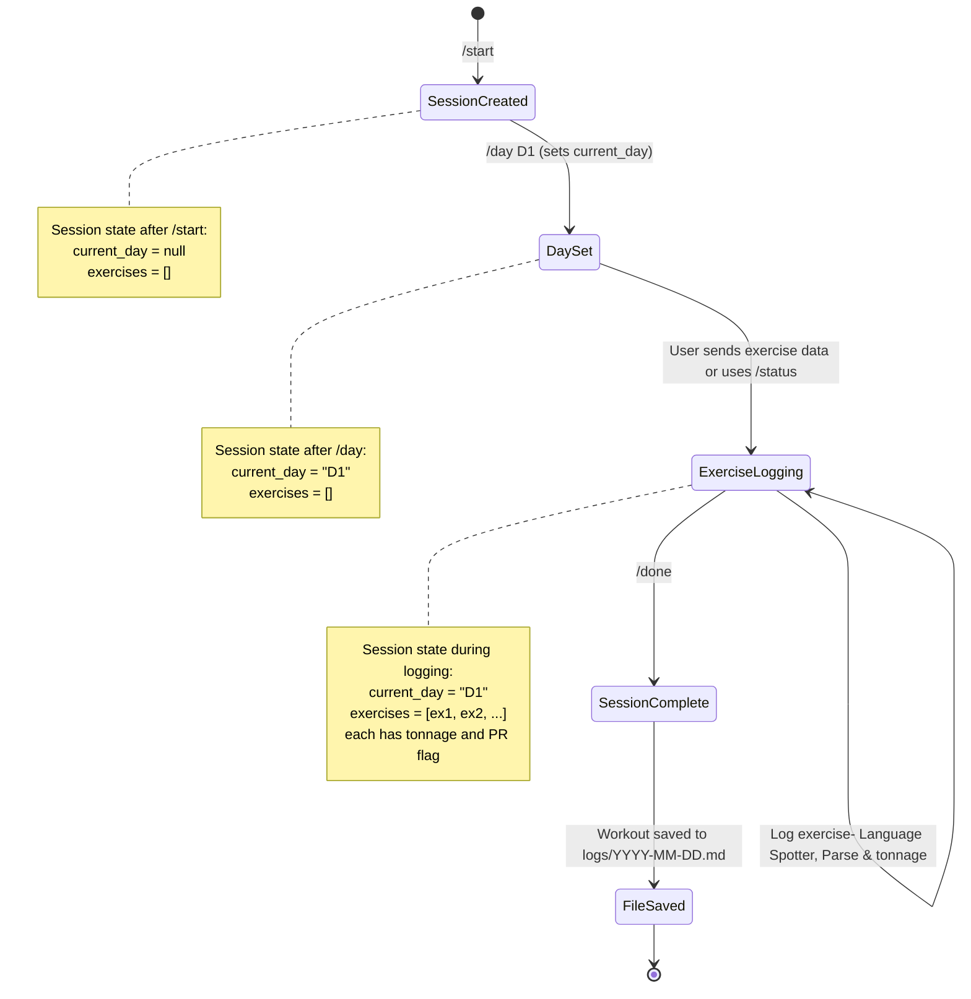
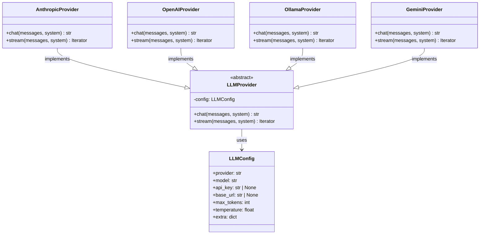

# coach-ai Architecture

This document provides a comprehensive overview of the coach-ai system architecture using the C4 Model (Levels 1 & 2) and sequence diagrams for the main use cases.

## Overview

**coach-ai** is a dual-role virtual coach application that:
1. **Tracks gym workouts** — Analyzes exercise data for a 4-day Powerbuilding split, calculates tonnage, detects PRs, and suggests progressive overload strategies
2. **Corrects English** — Every user interaction begins with a "Language Spotter" block that fixes grammar and vocabulary issues

The system runs in three independent entry points:
- **Claude Code Skill** — Direct integration in the Claude Code IDE
- **REST API** — FastAPI-based HTTP interface for programmatic access
- **Telegram Bot** — Real-time messaging interface for on-the-go coaching

---

## C4 Model - Level 1: System Context

The following diagram shows the high-level context of the coach-ai system and its interactions with external actors and systems.



---

## C4 Model - Level 2: Container Diagram

The following diagram shows the major containers and their relationships.



---

## Use Case 1: Track a Gym Workout

### Description

A user submits their workout data (exercise, weight, reps, sets) via Telegram. The system:
1. Corrects any English errors in the submission (Language Spotter)
2. Parses the workout data
3. Calculates tonnage based on the exercise type
4. Compares against the training program and prior sessions to detect PRs and suggest progressive overload
5. Logs the workout and returns coaching feedback

### Sequence Diagram



### Data Flow Details

**Input:**
- User message: `"squat 5x5 @ 100kg"` (plain text submission)

**Processing:**
1. **Language Spotter** — LLM corrects any grammar/vocabulary issues
2. **Parsing** — Extract exercise type, sets, reps, weight
3. **Tonnage Calculation** — For barbell: `(weight_per_side × 2 + 20kg bar) × reps × sets`
4. **PR Detection** — Compare against prior sessions for the same exercise
5. **Progressive Overload** — Suggest weight ↑, reps ↑, or volume ↑ based on program

**Output:**
- Grammar correction (if needed)
- Tonnage value and daily total
- PR flag (if applicable)
- Progression advice
- Log file entry in `logs/YYYY-MM-DD.md`

---

## Use Case 2: Correct English (Language Spotter)

### Description

The Language Spotter is embedded in every user interaction. Before the coach responds to any query, it:
1. Analyzes the user's message for grammar, vocabulary, and clarity issues
2. Provides corrections with explanations
3. Proceeds with the main coaching response

This is part of the dual-role design — every interaction is both a coaching moment and an English learning opportunity.

### Sequence Diagram



### Language Spotter Block Format

```
🔤 Language Spotter

Your message: "[original user message]"

Corrections:
- [error 1] → [correction] ([explanation])
- [error 2] → [correction] ([explanation])
- ...

---
[Main coaching response continues...]
```

### Examples

**User input:** "i did 3x5 barbell rows and felt really good!"

**Language Spotter output:**
```
🔤 Language Spotter

Your message: "i did 3x5 barbell rows and felt really good!"

Corrections:
- "i" → "I" (always capitalize the pronoun "I" in English)
- Everything else looks great! Clear, concise, and proper grammar.

---
[Coaching response...]
```

---

## Use Case 3: Initialize User Session (/start)

### Description

When a new user sends the `/start` command on Telegram, the system:
1. Captures the user's Telegram ID
2. Creates a new user session with default state (no training day set, empty exercise list)
3. Loads the training program data
4. Sends a welcome message explaining available commands
5. Prepares the session for subsequent workout logging

This is the entry point for all Telegram interactions — a user must issue `/start` before using other commands.

### Sequence Diagram



### Data State After /start

**Session object created:**
```json
{
  "user_id": 123456789,
  "current_day": null,
  "exercises": [],
  "message_history": [],
  "created_at": "2026-05-03T10:30:00Z"
}
```

**Available commands sent to user:**
| Command | Purpose |
|---------|---------|
| `/day D1` | Set active training day (D1, D2, D4, or D5) |
| `/status` | Display exercises for current day |
| `/done` | End session, save workout log, clear session |
| `/help` | Show command list |
| Any text | Log workout (parsed + Language Spotter correction) |

### Flow After /start



---

## Architecture Layers

### 1. Entry Point Layer

Three independent interfaces deliver the same coaching experience:

| Interface | Technology | Use Case |
|-----------|-----------|----------|
| **Claude Code Skill** | `.claude/skills/coach/SKILL.md` + Python | IDE-native experience; loads all resources |
| **REST API** | FastAPI + SessionStore | Programmatic access; HTTP clients |
| **Telegram Bot** | python-telegram-bot + UserSessionStore | Real-time mobile-friendly messaging |

### 2. LLM Abstraction Layer (`src/coach/llm/`)

Provider-agnostic interface supporting multiple LLM vendors:



**Configuration via `.env`:**
```env
LLM_PROVIDER=anthropic          # or: openai, ollama, gemini
LLM_MODEL=claude-haiku-4-5      # or: gpt-4o-mini, llama3.2, gemini-2.0-flash
LLM_API_KEY=sk-...              # Falls back to vendor env vars
LLM_BASE_URL=                   # Useful for Ollama or proxies
LLM_TEMPERATURE=0.7
LLM_MAX_TOKENS=2048
```

### 3. Data Layer

| Resource | Location | Purpose |
|----------|----------|---------|
| **System Prompt** | `prompts/SYSTEM_PROMPT.md` | Instructions for dual-role coaching + Language Spotter |
| **Training Program** | `data/program.json` | 4-day Powerbuilding split definition |
| **Templates** | `templates/*.md` | Output formatting (daily tracking, charts) |
| **Logs** | `logs/YYYY-MM-DD.md` | Session history and workout records (git-ignored) |

### 4. Session Management

- **REST API** — In-memory `SessionStore` (conversation history)
- **Telegram Bot** — Persistent `UserSessionStore` (user state + message history)
- **Claude Code Skill** — Stateless (conversation maintained by IDE)

---

## Technology Stack

| Layer | Technology | Version |
|-------|-----------|---------|
| **Language** | Python | ≥ 3.12 |
| **API Framework** | FastAPI | 0.100+ |
| **Telegram** | python-telegram-bot | 20.0+ |
| **LLM Clients** | anthropic, openai, ollama, google-generativeai | Latest |
| **Testing** | pytest, unittest.mock | 7.0+ |
| **Linting** | ruff | 0.1.0+ |

---

## Key Design Decisions

### 1. Provider Agnostic

The LLM abstraction layer allows swapping providers via `.env` without code changes. This enables:
- Cost optimization (Anthropic vs OpenAI vs Ollama)
- Vendor lock-in avoidance
- Testing with local models (Ollama)
- Multi-provider failover (future)

### 2. Streaming Support

All entry points support streaming responses for real-time feedback:
- **Telegram Bot** — Chunks printed in real-time; message edited on completion
- **REST API** — Server-Sent Events (SSE) or streaming responses
- **Claude Code Skill** — Streaming integrated into IDE output

### 3. Language Spotter as First-Class Feature

Rather than retrofitting grammar checking, it's baked into `SYSTEM_PROMPT.md` as a system instruction. Every response includes it, making English learning organic to the coaching experience.

### 4. Modular Entry Points

The same core logic (LLM layer + data) is consumed by three independent interfaces. This allows:
- Rapid prototyping (Claude Code Skill)
- Production deployment (REST API)
- Mobile-first interaction (Telegram Bot)
- Future integrations (CLI, Discord, Slack) with minimal code duplication

---

## Deployment Architecture

### Development

```
User's Machine
├── Claude Code IDE (loads SKILL.md)
├── Python venv (src/coach/)
└── .env (API keys)
```

### Production (Planned)

```
Cloud Infrastructure
├── REST API (FastAPI on serverless/container)
├── Telegram Bot (async worker)
├── LLM Provider (third-party API)
├── Session Store (PostgreSQL/Redis)
└── Logs (Cloud Storage)
```

---

## Future Extensions

1. **CLI Entry Point** — `python -m coach` with full interaction loop
2. **Discord Bot** — Same handlers as Telegram, different platform
3. **Session Persistence** — PostgreSQL backend for scalable multi-user deployment
4. **Telegram Inline Buttons** — Quick selection for exercise logging
5. **Analytics Dashboard** — Tonnage trends, strength curves, form assessment
6. **Video Analysis** — Integration with form-checking APIs

---

## Testing Strategy

- **Unit Tests** — LLM providers mocked with `patch.dict("sys.modules", ...)`
- **Integration Tests** — API endpoints, session management, logging
- **Smoke Tests** — Full workflow via each entry point
- **No Live API Calls** — All provider SDKs mocked to avoid API costs

Run tests:
```bash
pytest tests/ -v                                    # All tests
pytest tests/test_llm_providers.py -v              # LLM layer only
pytest tests/test_telegram.py -v                   # Telegram integration
```

---

## File Structure

```
coach-ai/
├── src/coach/
│   ├── llm/                    # Provider abstraction
│   │   ├── base.py             # LLMProvider ABC
│   │   ├── factory.py          # get_provider()
│   │   └── providers/
│   │       ├── anthropic.py
│   │       ├── openai.py
│   │       ├── ollama.py
│   │       └── gemini.py
│   ├── api/                    # REST API
│   │   ├── app.py              # FastAPI app + lifespan
│   │   ├── routes/
│   │   │   ├── chat.py         # POST /chat
│   │   │   └── health.py       # GET /health
│   │   └── session_store.py
│   ├── telegram/               # Telegram Bot
│   │   ├── bot.py              # CoachBot class
│   │   ├── handlers.py         # Message handlers
│   │   └── user_sessions.py
│   ├── cli.py                  # CLI entry point (future)
│   ├── logger.py               # Session logging
│   └── paths.py                # Resource file paths
├── prompts/
│   └── SYSTEM_PROMPT.md        # Dual-role + Language Spotter instructions
├── data/
│   └── program.json            # 4-day Powerbuilding split
├── templates/
│   ├── daily_tracking_table.md
│   └── evolution_chart.md
├── tests/                      # Unit & integration tests
├── .claude/skills/coach/
│   └── SKILL.md                # Claude Code skill
└── docs/
    ├── ARCHITECTURE.md         # This file
    ├── TELEGRAM_BOT_SETUP.md
    └── API_GUIDE.md
```

---

## Related Documentation

- **[CLAUDE.md](../CLAUDE.md)** — Project rules, setup, architecture overview
- **[SYSTEM_PROMPT.md](../prompts/SYSTEM_PROMPT.md)** — Coaching instructions + Language Spotter logic
- **[TELEGRAM_BOT_SETUP.md](./TELEGRAM_BOT_SETUP.md)** — Telegram deployment guide
- **[API_GUIDE.md](./API_GUIDE.md)** — REST API endpoint documentation

