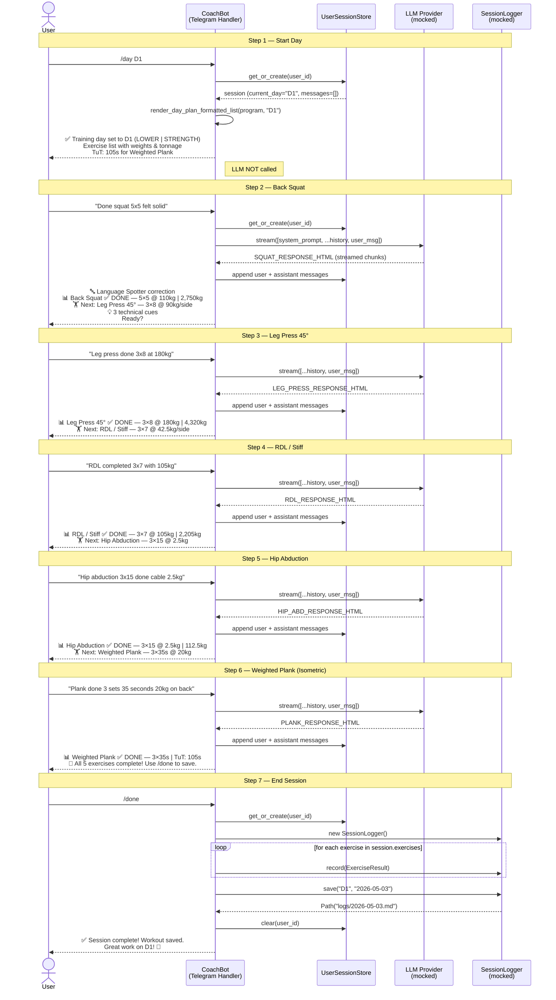

# Test Specification: E2E D1 Workout Session

## Overview

End-to-end test covering a complete Day 1 (Lower Strength) workout session in the Telegram bot, from day selection to session save.

**Test file:** `tests/test_e2e_d1_workout.py`
**Test function:** `test_d1_full_workout_e2e`

---

## Sequence Diagram



---

## D1 Exercise Reference

| # | Exercise | Type | Sets×Reps | Weight | Tonnage |
|---|---|---|---|---|---|
| 1 | Back Squat | barbell | 5×5 | 45kg/side → 110kg | 2,750 kg |
| 2 | Leg Press 45° | machine | 3×8 | 90kg/side → 180kg | 4,320 kg |
| 3 | RDL / Stiff | barbell | 3×7 | 42.5kg/side → 105kg | 2,205 kg |
| 4 | Hip Abduction | cable | 3×15 | 2.5 kg | 112.5 kg |
| 5 | Weighted Plank | isometric | 3×35s | 20 kg | TuT: 105s |

**Total planned volume (excl. plank): 9,387.5 kg**

---

## Step-by-Step Specification

### Step 1 — `/day D1`

| | |
|---|---|
| **Input** | `/day D1` |
| **Handler** | `CoachBot.handle_day` |
| **LLM called?** | No |

**Expected response contains:**
- `"D1"` and `"LOWER | STRENGTH"`
- All 5 exercise names: `Back Squat`, `Leg Press 45°`, `RDL / Stiff`, `Hip Abduction`, `Weighted Plank`
- Tonnage values: `2,750kg`, `4,320kg`, `2,205kg`, `112.5kg`
- `"TuT: 105s"` for Weighted Plank

**Expected session state after:**
- `session.current_day == "D1"`
- `session.messages == []`

---

### Step 2 — Back Squat Confirmation

| | |
|---|---|
| **Input** | `"Done squat 5x5 felt solid"` |
| **Handler** | `CoachBot.handle_message` |
| **LLM called?** | Yes (mock: `SQUAT_RESPONSE_HTML`) |

**Expected response contains:**
- `"Back Squat"` and `"DONE"`
- `"110kg"` and `"2,750kg"`
- `"Leg Press"` (next exercise cued)

**Expected session state after:**
- `len(session.messages) == 2`
- `session.messages[0].role == "user"`, `content == "Done squat 5x5 felt solid"`
- `session.messages[1].role == "assistant"`

---

### Step 3 — Leg Press 45° Confirmation

| | |
|---|---|
| **Input** | `"Leg press done 3x8 at 180kg"` |
| **Handler** | `CoachBot.handle_message` |
| **LLM called?** | Yes (mock: `LEG_PRESS_RESPONSE_HTML`) |

**Expected response contains:**
- `"Leg Press 45°"` and `"DONE"`
- `"180kg"` and `"4,320kg"`
- `"RDL"` (next exercise)

**Expected session state after:**
- `len(session.messages) == 4`

---

### Step 4 — RDL / Stiff Confirmation

| | |
|---|---|
| **Input** | `"RDL completed 3x7 with 105kg"` |
| **Handler** | `CoachBot.handle_message` |
| **LLM called?** | Yes (mock: `RDL_RESPONSE_HTML`) |

**Expected response contains:**
- `"RDL"` and `"DONE"`
- `"105kg"` and `"2,205kg"`
- `"Hip Abduction"` (next exercise)

**Expected session state after:**
- `len(session.messages) == 6`

---

### Step 5 — Hip Abduction Confirmation

| | |
|---|---|
| **Input** | `"Hip abduction 3x15 done cable 2.5kg"` |
| **Handler** | `CoachBot.handle_message` |
| **LLM called?** | Yes (mock: `HIP_ABD_RESPONSE_HTML`) |

**Expected response contains:**
- `"Hip Abduction"` and `"DONE"`
- `"2.5kg"` and `"112.5kg"`
- `"Weighted Plank"` (next exercise)

**Expected session state after:**
- `len(session.messages) == 8`

---

### Step 6 — Weighted Plank Confirmation

| | |
|---|---|
| **Input** | `"Plank done 3 sets 35 seconds 20kg on back"` |
| **Handler** | `CoachBot.handle_message` |
| **LLM called?** | Yes (mock: `PLANK_RESPONSE_HTML`) |

**Expected response contains:**
- `"Weighted Plank"` and `"DONE"`
- `"TuT"` and `"105s"` (isometric — no tonnage)
- Signal to use `/done`

**Expected session state after:**
- `len(session.messages) == 10` (5 user + 5 assistant)

---

### Step 7 — `/done`

| | |
|---|---|
| **Input** | `/done` |
| **Handler** | `CoachBot.handle_done` |
| **LLM called?** | No |

**Pre-condition:** `session.exercises` populated with 5 `ExerciseResult` objects:

```python
ExerciseResult("Back Squat",    sets=5, reps_done=5,  weight_kg=110.0, tonnage_kg=2750.0, tut_seconds=None, status=DONE)
ExerciseResult("Leg Press 45°", sets=3, reps_done=8,  weight_kg=180.0, tonnage_kg=4320.0, tut_seconds=None, status=DONE)
ExerciseResult("RDL / Stiff",   sets=3, reps_done=7,  weight_kg=105.0, tonnage_kg=2205.0, tut_seconds=None, status=DONE)
ExerciseResult("Hip Abduction", sets=3, reps_done=15, weight_kg=2.5,   tonnage_kg=112.5,  tut_seconds=None, status=DONE)
ExerciseResult("Weighted Plank",sets=3, reps_done=None,weight_kg=None, tonnage_kg=None,   tut_seconds=105,  status=DONE)
```

**Expected `SessionLogger` calls:**
- `logger.record()` called 5 times, one per exercise
- `logger.save("D1", date_str)` called exactly once

**Expected response contains:**
- `"Session complete"`
- `"D1"`

**Expected session state after:**
- `user_id not in bot.store.sessions` (session cleared)

---

## Mocking Strategy

| Dependency | Mock approach | Reason |
|---|---|---|
| `TELEGRAM_BOT_TOKEN` | `patch.dict(os.environ, {"TELEGRAM_BOT_TOKEN": "test_token"})` | `CoachBot.__init__` requires it |
| `CoachBot.provider` | `bot.provider = MagicMock()` | Direct injection after construction |
| `provider.stream()` | `bot.provider.stream.return_value = iter([RESPONSE_HTML])` | Reassigned per step |
| `SessionLogger` | `patch("src.coach.telegram.bot.SessionLogger")` | Patch at import site in bot module |
| `telegram.Update` | `MagicMock()` with `AsyncMock` on reply methods | Telegram SDK not available in tests |
| `data/programs/` | Loaded from disk via `Path(__file__).parent.parent / "data/programs/<id>.json"` | Real data, no mock needed |

---

## Notes

- `session.exercises` is populated manually before `/done` because the bot does not yet parse LLM text into structured `ExerciseResult` objects — that parser is a planned future feature.
- Tonnage formula for barbell: `(weight_per_side × 2 + 20kg bar) × reps × sets`. Back Squat: `(45 × 2 + 20) × 5 × 5 = 110 × 25 = 2,750 kg`.
- Weighted Plank has `reps_done=None`, `weight_kg=None`, `tonnage_kg=None` — `SessionLogger.record` does not raise `MissingDataError` because the isometric path checks `tut_seconds` instead.
